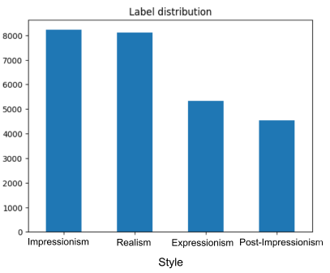
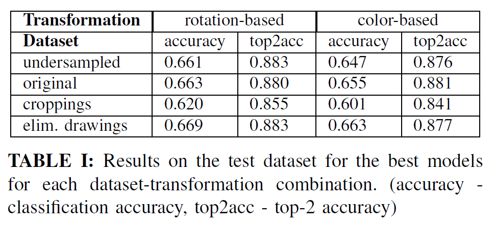
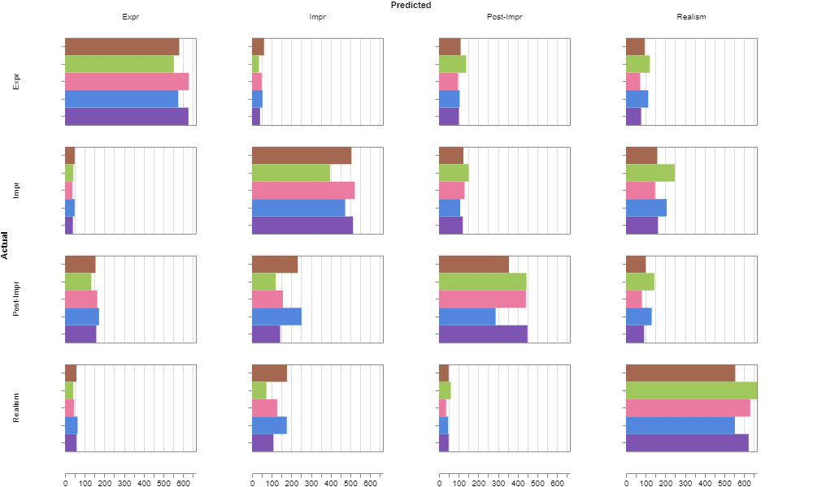

# Classification of artworks by art movement

The art-notebook-1.ipynb classifies paintings to the corresponding art movements. Images of paintings from four historically significant art movements were gathered: Realism (1840-1900), Impressionism (1870 - 1910), Post-Impressionism
(1886-1905) and Expressionism (1905-1920).

## Approach

Transfer learning with ResNet-50 was used. Specifically, the layers in the stage 5 of the ResNet-50 architecture were fine-tuned. Several dataset sampling/dataset transformation techniques were compared in the evaluation.

### Dataset sampling 

To account for the unequal distribution (see image above), the
following dataset variants were presented:

1) Undersampled balanced
2) Original
3) Croppings
4) Original with eliminated drawings

In each dataset, we create a separate folder for
training and testing data. 80% of the whole dataset
was used as training data and the remaining 20%
was used for testing.
The undersampled balanced dataset 1 contains
the same amount of images from each class. It was
constructed carefully by using stratified sampling,
where the distribution of genres in each class
in both training and testing datasets matched the
distribution of genres in the original dataset. The
croppings dataset also contains the same amount
of images for each class, this time by randomly
cropping the images from each class a specified
number of times. With this dataset we aimed
to emphasize the local painting differences. The
original dataset 2 and the dataset with eliminated
drawings 4 were trained with weighted loss, to
penalize the missclasification of under represented
classes.

### Data transformations

Both transformation variants included a
random vertical flip and a random horizontal
flip with probability 0,1. The first transformation
pipeline added random rotation between 0 and
180 degrees of the images. The other color-based
transformation included a random increase in
saturation, contrast and brightness of up to 150%
on top of the random flips. Color based transforms
were added to emphasize differences between art
movements, however no changes were applied to
the hue of the images, as we wanted to retain the
art movement-specific colors. 

## Results 

The usefulness of ResNet-50
for this task was recognized with test accuracy
of 67.7% and top2 test accuracy of 88.3% for
prediction of 4 art movements based solely on
image content.

Various data transformations were tested in
the process, with an interesting outcome of
rotations and flips being more beneficial for
accurate prediction than color transforms.

Normalized confusion matrix of the best models
from table I. In the color legend, the prefixes (before
) correspond to the dataset the model was trained on
and the suffixes are abbreviations of transformations used.
Mapping of the values is the following for datasets, us -
undersampled, orig - original, cr - croppings, ed - eliminated
drawings. Rotation-based transformations are marked as rot
and color-based as color. As it is evident, post-impressionist paintings presented the largest challenge in classification. 

